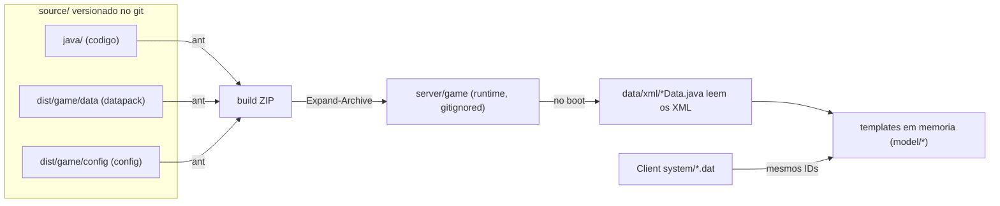

# 01 — Arquitetura e Fluxo

Antes de mexer em qualquer arquivo, entenda como o servidor é montado e por onde
os dados fluem. Isso evita 90% dos erros de iniciante (principalmente "editei e
não mudou nada" ou "editei e sumiu no rebuild").

## As três camadas

Um servidor L2J tem três coisas diferentes:

| Camada | O que é | Onde fica (fonte) | Linguagem |
|---|---|---|---|
| **Código** | A lógica do servidor (regras, rede, IA) | `source/L2J_Mobius_CT_0_Interlude/java/**` | Java |
| **Datapack** | Os dados do mundo (itens, npcs, lojas, drops, quests) | `source/.../dist/game/data/**` | XML/HTML |
| **Config** | Ajustes (rates, portas, sistemas custom) | `source/.../dist/game/config/**` | INI/XML |

O **build** (`ant`) junta código + datapack + config num ZIP, que é extraído em
`server/`. É `server/` que efetivamente roda.



## A REGRA DE OURO: onde editar

`server/game/` é **descartável**. Ele é recriado pelo build e está no `.gitignore`.

- ❌ **NÃO** edite `server/game/data/...` para mudanças permanentes — some no próximo `ant`.
- ✅ **EDITE** `source/L2J_Mobius_CT_0_Interlude/dist/game/data/...` (persiste, vai pro git e pro build).

Fluxo permanente correto:

```
1. Editar em source/.../dist/game/data/... (ou dist/game/config/...)
2. ant   (regenera o ZIP e/ou copia)
3. Reiniciar servidor  (ou //reload no jogo para dados suportados)
```

> Para **testar rápido** sem rebuildar, você pode editar direto em `server/game/data/`
> e usar `//reload` — mas depois **replique a mudança em `source/`** senão perde.

## Fluxo de boot (como um XML vira comportamento no jogo)

1. O Game Server inicia (`GameServer.java`).
2. Cada parser em `.../gameserver/data/xml/*Data.java` roda uma vez e **lê o XML
   correspondente** do datapack.
   - Ex.: `ItemData.java` lê `data/stats/items/*.xml`.
   - Ex.: `NpcData.java` lê `data/stats/npcs/*.xml`.
   - Ex.: `BuyListData.java` lê `data/buylists/*.xml`.
3. Cada linha do XML vira um **objeto template** em memória (pacote `model/*`),
   ex.: `ItemTemplate`, `NpcTemplate`, `BuyListHolder`.
4. Quando um jogador interage (mata um mob, abre uma loja), o servidor usa esses
   templates em memória — **não lê o XML de novo**.

Consequência prática: mudou o XML? Precisa **recarregar** (reiniciar ou `//reload`)
para o servidor reler e recriar os templates.

## Ciclo de iteração: reload vs rebuild

| Você mudou... | Como aplicar |
|---|---|
| XML de datapack (item, npc, loja, drop) | `//reload` no jogo (rápido) ou reiniciar |
| Config `.ini` | Normalmente **reiniciar** o Game Server |
| Código Java (`.java`) | `ant` (recompila) + reiniciar o servidor |
| Client (`.dat`, ícone) | Reabrir o client (ver [09_CLIENT_SIDE.md](09_CLIENT_SIDE.md)) |

Comando de recarga no jogo (GM nível 100):

```
//reload
```
Abre um painel com botões (multisell, buylist, npc, skill, etc.). Detalhes em
[08_CODIGO_FONTE.md](08_CODIGO_FONTE.md).

## Servidor ↔ Client (por que itens novos têm "dois lados")

O servidor conhece um item pelo **ID** (ex.: item 200 = "Sage's Staff"). O client
também tem uma tabela de itens em `system/itemname-e.dat`, `weapongrp.dat`, etc.,
indexada pelo **mesmo ID**.

- Se você criar o item 30000 só no servidor, ele funciona, mas no client aparece
  **sem nome e sem ícone** (ou com um placeholder).
- Para um item aparecer bonito, o **mesmo ID** precisa existir também no client.

Por isso, criar um item 100% novo (ex.: Vesper, que não existe no Interlude) tem
parte servidor ([03_ITENS.md](03_ITENS.md)) e parte client ([09_CLIENT_SIDE.md](09_CLIENT_SIDE.md)).

## Onde estão as coisas (atalho)

| Quero mexer em... | Datapack fonte |
|---|---|
| Itens | `source/.../dist/game/data/stats/items/` |
| NPCs / mobs / drops | `source/.../dist/game/data/stats/npcs/` |
| Lojas (venda) | `source/.../dist/game/data/buylists/` |
| Trocas / craft | `source/.../dist/game/data/multisell/` |
| Enchant | `source/.../dist/game/data/EnchantItemData.xml` e `EnchantItemGroups.xml` |
| Spawns | `source/.../dist/game/data/spawns/` |
| Diálogos de NPC | `source/.../dist/game/data/html/` |
| Rates / custom | `source/.../dist/game/config/` |
| Código | `source/.../java/org/l2jmobius/gameserver/` |
