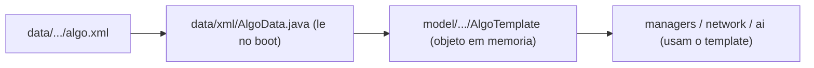

# 08 — Código-Fonte para Modders

Quando o datapack não basta (você quer mudar **comportamento**, não só dados), é
hora de mexer no Java. Este doc é o mapa: onde está cada coisa, o padrão que se
repete (parser → template → uso), e o loop de build/deploy.

Raiz: `source/L2J_Mobius_CT_0_Interlude/java/org/l2jmobius/`

## Mapa de pacotes (`gameserver/`)

| Pacote | Função |
|---|---|
| `data/xml/` | **Parsers** `*Data.java` — leem os XML do datapack no boot |
| `model/` | **Objetos do jogo**: `item/`, `actor/` (Player, Npc, Monster), `buylist/`, `multisell/`, `skill/`, `holders/` |
| `network/clientpackets/` | Pacotes **recebidos** do client (ações do jogador) |
| `network/serverpackets/` | Pacotes **enviados** ao client (respostas/atualizações) |
| `handler/` | Interfaces e registros de handlers (`IItemHandler`, `ItemHandler`...) |
| `managers/` | Gerenciadores globais (spawn, olympiad, siege, castle...) |
| `ai/` | IA base dos NPCs |
| `taskmanagers/` | Tarefas periódicas (regen, decay, autosave) |
| `cache/`, `geoengine/`, `scripting/`, `util/`, `communitybbs/` | Infra e utilidades |

Fora de `gameserver/`: `commons/` (banco de dados, threads, util) e `loginserver/`.

## O padrão que se repete: Parser → Template → Uso

Quase todo dado segue este trio. Entender um é entender todos:



Exemplo concreto (itens):

| Papel | Classe |
|---|---|
| XML | `data/stats/items/*.xml` |
| Parser | `data/xml/ItemData.java` (`load()`, `getTemplate(id)`) |
| Template | `model/item/ItemTemplate.java` + `Weapon`/`Armor`/`EtcItem` |
| Instância no mundo | `model/item/instance/Item.java` |

### Os parsers principais (`data/xml/`, 43 no total)

| Parser | Lê | Cria |
|---|---|---|
| `ItemData` | `stats/items/*.xml` | `ItemTemplate` |
| `NpcData` | `stats/npcs/*.xml` | `NpcTemplate` |
| `SkillData` | `stats/skills/*.xml` | `Skill` |
| `BuyListData` | `buylists/*.xml` | `BuyListHolder` |
| `MultisellData` | `multisell/*.xml` | `MultisellListHolder` |
| `EnchantItemData` | `EnchantItemData.xml` | scrolls |
| `EnchantItemGroupsData` | `EnchantItemGroups.xml` | grupos de chance |
| `RecipeData` | `Recipes.xml` | receitas |
| `ArmorSetData`, `DoorData`, `HennaData`, `ExperienceData`, `PlayerTemplateData`... | vários | vários |

> **Padrão de uso:** `ItemData.getInstance().getTemplate(id)`. Todo parser é um
> singleton com `getInstance()`.

## Handlers — os "plugins" (`data/scripts/handlers/`)

Handlers dão comportamento sem mexer no core. Ficam no **datapack** (são scripts
compilados junto). Tipos (interfaces em `gameserver/handler/`):

| Interface | Handler faz | Exemplo |
|---|---|---|
| `IItemHandler` | Ao **usar** um item | `EnchantScrolls`, poções |
| `IAdminCommandHandler` | Comando `//xxx` | `//spawn`, `//reload` |
| `IVoicedCommandHandler` | Comando `.xxx` no chat | `.menu`, `.online` |
| `IUserCommandHandler` | Comando de tecla | `/loc`, `/time` |
| `IBypassHandler` | Botões nos HTML dos NPCs | `_Buy`, `_multisell` |
| `IActionClickHandler` | Clique num alvo | clicar em NPC/item |
| `ITargetTypeHandler` | Tipos de alvo de skill | AoE, single |
| `IChatHandler` | Canais de chat | shout, trade |

### Registro central: `MasterHandler.java`

Todos os handlers são registrados em
`data/scripts/handlers/MasterHandler.java`. Para **adicionar** um handler novo:

1. Crie a classe (ex.: `handlers/items/MeuScroll.java` implementando `IItemHandler`).
2. Registre em `MasterHandler.java` na lista do tipo certo.
3. `ant` + reiniciar.

Exemplo real do handler que abre a janela de enchant
(`handlers/items/EnchantScrolls.java`):

```java
public class EnchantScrolls implements IItemHandler
{
    @Override
    public boolean onItemUse(Playable playable, Item item, boolean forceUse)
    {
        // valida condicoes e abre ChooseInventoryItem
        player.setActiveEnchantItemId(item.getObjectId());
        player.sendPacket(new ChooseInventoryItem(item.getId()));
        return true;
    }
}
```

> O `onItemUse` só abre a UI. A **decisão** de sucesso/falha do enchant fica no
> pacote, não no handler — ver abaixo.

## Pacotes de rede (onde as ações "acontecem de verdade")

- `network/clientpackets/RequestEnchantItem.java` — recebe o item escolhido, calcula
  a chance e aplica sucesso/falha/quebra. **É aqui que se muda o comportamento do
  enchant** (ex.: blessed nunca resetar).
- `network/clientpackets/RequestBuyItem.java` / `RequestSellItem.java` — compra/venda.
- `network/clientpackets/RequestMagicSkillUse.java` — uso de skill.
- `network/serverpackets/*` — o que é mandado de volta (ex.: `InventoryUpdate`).

Padrão: pacote do client → validação → altera `model/actor/Player` → envia
serverpacket de atualização.

## Onde mudar coisas comuns

| Quero mudar... | Vá em |
|---|---|
| Regras de enchant (falha, blessed) | `network/clientpackets/RequestEnchantItem.java` |
| Efeito ao usar um item | `handlers/items/` + `MasterHandler` |
| Novo comando `//` de GM | `handlers/admincommandhandlers/` + `MasterHandler` |
| Novo comando `.` de jogador | `handlers/voicedcommandhandlers/` + `MasterHandler` |
| Como um mob age | `data/scripts/ai/` |
| Fórmula de dano/stats | `model/actor/` + `model/stats/` |
| Novo tipo de item | `model/item/` + `ItemData` |

## Loop de build/deploy (Ant)

O build está em `source/L2J_Mobius_CT_0_Interlude/build.xml`.

```powershell
cd C:\Users\Pandinha\codes\l2ServerTest\source\L2J_Mobius_CT_0_Interlude
ant                 # compila java + empacota datapack/config num ZIP em dist/
```

Depois é preciso levar o resultado para `server/`:
- Se você usa o ZIP: extraia por cima de `server/` (mantendo suas configs locais).
- Se mudou **só datapack/config** (sem Java): pode copiar os arquivos alterados
  direto para `server/game/...` (mais rápido que rebuildar tudo).

Fluxo prático por tipo de mudança:

| Mudou | Comando | Aplicar |
|---|---|---|
| Só XML/HTML de datapack | copiar p/ `server/game/data/` | `//reload` no jogo |
| Só `.ini` | copiar p/ `server/game/config/` | reiniciar Game Server |
| Java (core ou handler) | `ant` | reiniciar Game Server |

> ⚠️ Nunca edite apenas em `server/` para mudanças permanentes — a fonte de verdade
> é `source/.../dist/game/**` e `source/.../java/**`. Ver [01_ARQUITETURA.md](01_ARQUITETURA.md).

## O painel `//reload`

O comando GM `//reload` (`handlers/admincommandhandlers/AdminReload.java`) recarrega
dados sem reiniciar. Suporta, entre outros: `npc`, `buylist`, `multisell`, `skill`,
`htm`, `zone`, `door`, `teleport`, `quest`. Nem tudo é recarregável (configs `.ini`
e mudanças de Java **sempre** exigem reinício).
