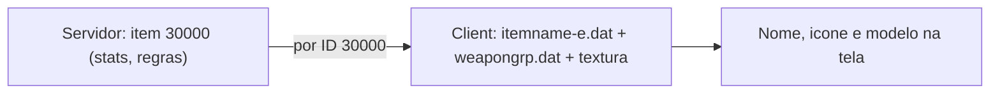

# 09 — Client-Side

O servidor conhece itens/NPCs por **ID**. O client precisa do **mesmo ID** para
mostrar nome, ícone e modelo 3D. Este doc cobre o que editar no client para que
suas customizações apareçam bonitas.

Client: `C:\Users\Pandinha\L2\Interlude-Client\`
Protocolo: **746** (Interlude / CT2.0).

## Por que "dois lados"

Se o ID existe só no servidor: o item **funciona** (equipa, dá stats), mas aparece
sem nome/ícone corretos. Para ficar completo, o mesmo ID tem que existir nos `.dat`
do client.

## Os arquivos `.dat` do client (`system/`)

| Arquivo | Contém | Serve para |
|---|---|---|
| `itemname-e.dat` | **Nomes e descrições** de itens | Nome que aparece no inventário/tooltip |
| `weapongrp.dat` | Dados de **armas** (mesh, textura, ícone, som) | Aparência de armas |
| `armorgrp.dat` | Dados de **armaduras** | Aparência de armaduras |
| `etcitemgrp.dat` | Dados de **etc items** (materiais, scrolls) | Ícone de itens diversos |
| `npcname-e.dat` | **Nomes** de NPCs | Nome sobre a cabeça do NPC |
| `npcgrp.dat` | **Modelo/aparência** de NPCs | Como o NPC parece |
| `skillname-e.dat` | Nomes de skills | Nome das skills |
| `skillgrp.dat` | Dados de skills (ícone, níveis) | Ícone/tooltip de skills |

> O sufixo `-e` = versão em inglês (English). Cada idioma tem seu arquivo de nomes.

Estes `.dat` são **binários criptografados** (não abrem em editor de texto). Você
precisa de uma ferramenta para descriptografar → editar (vira `.txt`) → recriptografar.

## Ferramentas

| Ferramenta | Uso |
|---|---|
| **L2FileEdit** | Descriptografa/edita/recriptografa `.dat` (mais comum p/ Interlude) |
| **L2 Client Dat Editor / DatEditor** | Editor visual dos `.dat` por versão de crônica |
| **UnrealEd / L2Tool / UModel** | Abrir/editar `.utx` (texturas), `.ukx`/`.usx` (meshes) |

> Ao usar qualquer ferramenta, **escolha a crônica/versão Interlude (protocol 746)**,
> senão a estrutura dos `.dat` não bate e corrompe o arquivo.

### Fluxo genérico de edição de um `.dat`

1. **Backup** do `system/` (você já tem `system_backup_...`).
2. Abra o `.dat` na ferramenta (modo Interlude).
3. Descriptografe → edite o registro do seu ID → salve/recriptografe.
4. Substitua o `.dat` em `system/`.
5. Reabra o client.

## Texturas e ícones

| Pasta | Conteúdo | Formato |
|---|---|---|
| `systextures/` | Ícones (inclui `icon.*`) e UI | `.utx` (pacote de texturas) |
| `textures/` | Texturas de mundo/itens | `.utx` |
| `animations/` | Animações de personagens/mobs | `.ukx` |
| `staticmeshes/` | Modelos estáticos | `.usx` |

O `icon="icon.weapon_long_sword_i00"` no XML do item aponta para uma textura dentro
de um `.utx` de `systextures/`. Para um **ícone novo**:
1. Crie a imagem (geralmente 32×32, formato compatível DXT).
2. Importe num pacote `.utx` (UnrealEd/L2Tool).
3. Referencie no XML do item: `icon="icon.meu_icone_i00"`.

> **Atalho:** para itens custom, **reuse ícones existentes** (ex.:
> `icon.weapon_long_sword_i00`). Aí você não mexe em textura nenhuma — só precisa do
> nome no `itemname-e.dat`.

## Sincronizar IDs servidor ↔ client (a regra de ouro do client)

Para um item custom aparecer 100%:

| Onde | O que colocar |
|---|---|
| Servidor `stats/items` | `<item id="30000" ...>` |
| Client `itemname-e.dat` | registro do ID 30000 com nome/descrição |
| Client `weapongrp`/`armorgrp`/`etcitemgrp` | registro do ID 30000 (mesh/ícone) |

Para um NPC custom:

| Onde | O que colocar |
|---|---|
| Servidor `stats/npcs` | `<npc id="50000" ...>` |
| Client `npcname-e.dat` | nome do ID 50000 |
| Client `npcgrp.dat` | aparência do ID 50000 (pode reusar de outro NPC) |

> **Distribuir para os jogadores:** qualquer `.dat`/textura que você mudar precisa
> ir para o client de **cada jogador** (via patch/updater). Sem isso, eles veem
> "sem nome/ícone" ou crasham se referenciar um mesh inexistente.

## Nível de risco por tipo de mudança

| Mudança | Dificuldade | Risco de crash no client |
|---|---|---|
| Só `itemname-e.dat` (nome) reusando ícone/mesh existente | Baixa | Baixo |
| Ícone novo (`.utx`) | Média | Médio |
| Mesh/modelo 3D novo (`.ukx`/`.usx`) | Alta | Alto (client crasha se ID referencia mesh ausente) |

> Regra prática: **reuse visual existente** sempre que possível. Só parta para mesh
> novo quando o visual for realmente essencial (ex.: Vesper "de verdade").

## Caso Vesper no client (item que não existe no Interlude)

- **Rota simples:** stats no servidor + nome no `itemname-e.dat`, **reusando** o
  visual de uma arma S existente (Draconic Bow, Forgotten Blade...). Sem crash,
  sem mesh novo.
- **Rota completa:** importar ícone (`.utx`), mesh (`.ukx`/`.usx`) e textura da
  Vesper de uma crônica posterior, registrar em `weapongrp.dat` e distribuir o patch.
  Muito mais trabalho e propenso a crash se algo faltar.

Passo a passo na receita 2 de [10_RECEITAS_PRATICAS.md](10_RECEITAS_PRATICAS.md).

## Checklist de client

- [ ] Backup do `system/` feito
- [ ] Ferramenta na versão **Interlude (746)**
- [ ] Mesmo **ID** no servidor e nos `.dat`
- [ ] Ícone/mesh: reusado (seguro) ou importado e testado
- [ ] Patch distribuído aos jogadores (se aplicável)
