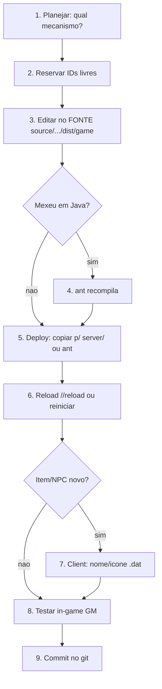

# 11 — Pipeline Completo (Exemplos ponta a ponta)

Enquanto a [doc 10](10_RECEITAS_PRATICAS.md) mostra receitas de itens/lojas, esta doc
mostra **o fluxo de trabalho completo** — do planejamento ao teste logado no jogo —
usando 3 features reais como exemplo:

- **A.** Um **NPC Buffer** com buffs separados por tipo + **Heal (HP/MP/CP) seu e do pet**.
- **B.** Um **Cap (+10% HP e +10% CP)**.
- **C.** Uma **Tatuagem de mago (+10% Casting Speed)**.

> Tudo aqui foi verificado no **seu** datapack/código. Os caminhos e formatos são reais.

## O pipeline universal (vale para qualquer feature)



### Checklist (imprima na cabeça)

1. **Planejar:** a feature é *datapack* (XML), *item+skill*, *config* (`.ini`) ou *código* (Java)?
2. **IDs livres:** itens/skills/npcs custom em faixas altas (ex.: `30000+`) pra não colidir.
3. **Editar no FONTE:** `source/L2J_Mobius_CT_0_Interlude/dist/game/**` (nunca só em `server/`).
4. **Java?** rode `ant` (recompila). Só XML/HTML? pode copiar direto.
5. **Deploy:** leve os arquivos para `server/game/**`.
6. **Aplicar:** `//reload` (datapack) ou **reiniciar** (config/Java/itens).
7. **Client:** item/npc novo precisa de nome/ícone nos `.dat` ([doc 09](09_CLIENT_SIDE.md)).
8. **Testar:** logar e usar comandos GM.
9. **Commit** no git.

### IDs usados nestes exemplos

| Recurso | ID |
|---|---|
| Cap item | `30010` |
| Skill passiva do Cap | `30010` |
| Tatuagem item | `30011` |
| Skill passiva da Tatuagem | `30011` |
| NPC Buffer (já existe) | `50008` |
| Arquivo de itens custom | `data/stats/items/30000-30099-custom.xml` |
| Arquivo de skills custom | `data/stats/skills/30000-30099-custom.xml` |

---

## Exemplo A — NPC Buffer (buffs por tipo + Heal HP/MP/CP e pet)

**Boa notícia:** o L2J Mobius já traz um **Scheme Buffer** completo. Não precisamos
programar nada — só **habilitar, spawnar e customizar**. Ele já tem:
categorias por tipo, alvo **Me/Pet**, e **Heal** que restaura HP/MP/CP do jogador e
HP/MP do pet (pet não tem CP no L2).

### Peças (arquivos reais)

| Papel | Caminho |
|---|---|
| NPC | `data/stats/npcs/custom/SchemeBuffer.xml` (id `50008`, `type="SchemeBuffer"`) |
| Lista de buffs | `data/SchemeBufferSkills.xml` (categorias) |
| Telas (HTML) | `data/html/mods/SchemeBuffer/50008.htm` (e `-1/-2/-3`) |
| Config | `config/Custom/SchemeBuffer.ini` |
| Código (core) | `org.l2jmobius.gameserver.model.actor.instance.SchemeBuffer` |

### Como o Heal já funciona (verificado no código)

No `SchemeBuffer.java`, o bypass `heal` faz:

```java
player.setCurrentHpMp(player.getMaxHp(), player.getMaxMp());
player.setCurrentCp(player.getMaxCp());               // CP do jogador
final Summon summon = player.getSummon();
if (summon != null)
    summon.setCurrentHpMp(summon.getMaxHp(), summon.getMaxMp()); // HP/MP do pet
```

Ou seja: **HP + MP + CP** seu, e **HP + MP** do pet — exatamente o pedido.

### Passo a passo

**1) Config** — `source/.../dist/game/config/Custom/SchemeBuffer.ini`:

```ini
BufferMaxSchemesPerChar = 4
BufferItemId = 57              # moeda do buff (57 = adena)
BufferStaticCostPerBuff = -1   # -1 = usa o price de cada buff no XML
```

**2) Buffs separados por tipo** — `source/.../dist/game/data/SchemeBufferSkills.xml`.
As categorias são os `<category type="...">`. O menu já mostra botões por tipo
(Buffs, Resist, Songs, Dances, Chants, Special). Exemplo real:

```xml
<category type="Buffs">
    <buff id="1045" level="1" price="0" desc="Increases maximum HP." /> <!-- Blessed Body -->
    <buff id="1048" level="1" price="0" desc="Increases maximum MP." /> <!-- Blessed Soul -->
    <buff id="1085" level="1" price="0" desc="Increases Casting Spd." /> <!-- Acumen -->
    <!-- adicione/organize os buffs desta categoria aqui -->
</category>
<category type="Dances"> ... </category>
<category type="Songs">  ... </category>
```

> **Adicionar um buff a uma categoria:** basta uma linha `<buff id="SKILL" level="N" price="CUSTO" desc="..."/>`.
> **Criar uma categoria nova:** adicione outro `<category type="MinhaCat">` — o botão
> aparece sozinho na tela de edição de scheme. Para aparecer no menu principal,
> adicione o botão no `50008.htm` (ver passo 4).
> **Auto-buff:** as categorias especiais `MAGE_GROUP` e `FIGHTER_GROUP` definem o que
> o botão "Auto Buff" aplica para mago/lutador.

**3) Preço/custo dos buffs:** o `price` de cada `<buff>` (em `BufferItemId`); ou fixe
um custo por buff com `BufferStaticCostPerBuff`.

**4) (Opcional) Ajustar o menu** — `data/html/mods/SchemeBuffer/50008.htm`. Os botões
usam bypasses do core:

| Botão / bypass | Efeito |
|---|---|
| `npc_%objectId%_manual;Buffs;1;me` | Abre a categoria "Buffs", página 1, alvo você |
| `..._manual;Dances;1;pet` | Categoria "Dances" no **pet** |
| `npc_%objectId%_heal` | **Heal** (HP/MP/CP seu + HP/MP do pet) |
| `npc_%objectId%_support` | Gerenciar schemes (criar/editar/usar) |
| `npc_%objectId%_autobuff;me` | Auto-buff por classe |
| `npc_%objectId%_cleanup` | Remove todos os buffs |

Quer botões de heal separados (ex.: "Heal só CP")? Dá pra fazer **sem código** só se o
core tiver o bypass; como o core só tem `heal` (full), um heal parcial exigiria
adicionar um novo caso no `SchemeBuffer.onBypassFeedback` (ex.: `healcp`) — ver
[doc 08](08_CODIGO_FONTE.md). Para a maioria, o `heal` full já resolve.

**5) Spawnar o NPC.** Rápido pra testar: `//spawn 50008`. Permanente: adicione em um
`data/spawns/**` (ver [doc 04](04_NPCS_E_LOJAS.md)):

```xml
<npc id="50008" x="147450" y="26520" z="-2200" heading="16384" respawnDelay="60" />
```

**6) Deploy + aplicar:** copie os arquivos alterados para `server/game/**` (ou `ant`),
depois `//reload npc` e `//reload htm` (o `SchemeBufferSkills.xml` é lido no boot —
se editou os buffs, **reinicie** o Game Server).

**7) Testar (logado):**
- `//spawn 50008` → clique no NPC.
- Clique **Buffs/Dances/...** → escolha **Me** ou **Pet** → aplique um buff.
- Invoque um pet/summon e teste **Pet**.
- Clique **Heal** com HP/CP/MP baixos (e com pet) → tudo enche.

> O NPC 50008 usa `displayId="30849"`, então já aparece com visual de NPC retail no
> client — **não precisa mexer no client** para este exemplo.

---

## Exemplo B — Cap com +10% HP e +10% CP

Bônus percentual em item = **item concede uma skill passiva**. Fluxo: criar a
**skill passiva** (mul em `maxHp`/`maxCp`) → criar o **item** (Armor, slot cabeça) →
anexar a skill ao item.

### 1) Criar a skill passiva

`source/.../dist/game/data/stats/skills/30000-30099-custom.xml`:

```xml
<?xml version="1.0" encoding="UTF-8"?>
<list xmlns:xsi="http://www.w3.org/2001/XMLSchema-instance" xsi:noNamespaceSchemaLocation="../../xsd/skills.xsd">
    <skill id="30010" levels="1" name="Vitality Cap">
        <operateType>P</operateType>          <!-- P = passiva (ativa ao equipar) -->
        <targetType>SELF</targetType>
        <effects>
            <effect name="Buff">
                <mul stat="maxHp">1.1</mul>   <!-- +10% HP -->
                <mul stat="maxCp">1.1</mul>   <!-- +10% CP -->
            </effect>
        </effects>
    </skill>
</list>
```

> O padrão vem de skills reais: passiva = `operateType=P`; bônus percentual = `<mul stat="...">`
> (ex.: Acumen usa `<mul stat="mAtkSpd">`; Blessed Body usa `maxHp`). `1.1` = ×1.10 = +10%.

### 2) Criar o item (cap) e anexar a skill

`source/.../dist/game/data/stats/items/30000-30099-custom.xml`:

```xml
<?xml version="1.0" encoding="UTF-8"?>
<list xmlns:xsi="http://www.w3.org/2001/XMLSchema-instance" xsi:noNamespaceSchemaLocation="../../xsd/items.xsd">
    <item id="30010" type="Armor" name="Cap of Vitality">
        <set name="icon" val="icon.armor_helmet_i00" />   <!-- reusa ícone existente -->
        <set name="default_action" val="EQUIP" />
        <set name="bodypart" val="head" />                  <!-- slot cabeça -->
        <set name="armor_type" val="LIGHT" />
        <set name="crystal_type" val="S" />
        <set name="weight" val="500" />
        <set name="price" val="1000000" />
        <stats>
            <stat type="pDef">50</stat>
        </stats>
        <skills>
            <skill id="30010" level="1" />                 <!-- a passiva criada acima -->
        </skills>
    </item>
</list>
```

### 3) Deploy + aplicar

- Copie os 2 arquivos para `server/game/data/stats/skills/` e `.../items/` (ou `ant`).
- **Reinicie** o Game Server (skills e itens são carregados no boot; não confie em `//reload` isolado aqui).

### 4) Client

Reusamos ícone existente, então funciona. Para o **nome** "Cap of Vitality" aparecer,
adicione o ID `30010` no `itemname-e.dat` e no `armorgrp.dat` ([doc 09](09_CLIENT_SIDE.md)).
Sem isso, o item funciona (dá o bônus) mas aparece com nome/placeholder genérico.

### 5) Testar (logado)

```
//create_item 30010 1
```
- Veja seu HP/CP **máximos** antes de equipar (abra a ficha do personagem).
- Equipe o cap → HP e CP máximos sobem ~10%.
- Desequipe → voltam ao normal.

---

## Exemplo C — Tatuagem de mago (+10% Casting Speed)

"Tatuagem/Dye" retail (`hennaList.xml`) só altera **atributos base** (STR/CON/INT/…),
**não** cast speed. Então a tatuagem de cast speed é feita como **item + skill passiva**
(igual ao cap), usando o stat `mAtkSpd`.

### 1) Skill passiva de cast speed

Adicione no mesmo `data/stats/skills/30000-30099-custom.xml`:

```xml
<skill id="30011" levels="1" name="Tattoo of Casting">
    <operateType>P</operateType>
    <targetType>SELF</targetType>
    <effects>
        <effect name="Buff">
            <mul stat="mAtkSpd">1.1</mul>   <!-- +10% Casting Spd. -->
        </effect>
    </effects>
</skill>
```

### 2) Item "tatuagem" (slot sem modelo 3D → sem risco no client)

Use o slot **shirt** (Underwear): é um acessório sem mesh visível, ideal para uma
"tatuagem". Adicione no `data/stats/items/30000-30099-custom.xml`:

```xml
<item id="30011" type="Armor" name="Tattoo of Casting">
    <set name="icon" val="icon.accessory_soul_of_flame_i00" /> <!-- reusa ícone -->
    <set name="default_action" val="EQUIP" />
    <set name="bodypart" val="shirt" />
    <set name="crystal_type" val="S" />
    <set name="weight" val="10" />
    <set name="price" val="1000000" />
    <skills>
        <skill id="30011" level="1" />
    </skills>
</item>
```

### 3) (Opcional) Restringir a magos

Como está, qualquer classe que equipar ganha o bônus. Para travar só para magos, há
duas rotas:

- **Distribuição:** vender/dar o item só para magos (via quest/loja específica). Simples, sem código.
- **Condição na skill:** skills suportam bloco `<conditions>` (como as skills de
  classe). Você pode condicionar o efeito a classes mágicas. Se precisar disso,
  veja skills de classe existentes como modelo e replique a condição — detalhes de
  onde editar em [doc 08](08_CODIGO_FONTE.md).

> Alternativa "henna de verdade": se quiser uma **tatuagem que dá atributo base**
> (ex.: +INT), aí sim use `hennaList.xml` com `<stats int="1" .../>` e a lista de
> `<classId>` de magos — esse mecanismo é nativo e já restrito por classe. Mas ele
> **não** faz cast speed.

### 4) Deploy, client e teste

- Deploy + **reiniciar** (igual ao cap).
- Client: nome/ícone do `30011` no `itemname-e.dat`/`etcitemgrp` se quiser o nome certo.
- Testar:
```
//create_item 30011 1
```
Equipe com um mago, lance uma magia e compare o tempo de cast (ou veja "Casting Spd."
na ficha) — deve subir ~10%.

---

## Resumo: o que tocamos em cada exemplo

| Exemplo | Arquivos alterados | Precisa Java? | Aplicar |
|---|---|---|---|
| A. Buffer | `SchemeBufferSkills.xml`, `50008.htm`, `SchemeBuffer.ini`, spawn | Não (heal já existe) | reiniciar + `//spawn 50008` |
| B. Cap +HP/CP | `skills/30000-...custom.xml`, `items/30000-...custom.xml` | Não | reiniciar + `//create_item 30010` |
| C. Tatuagem cast | mesmos arquivos custom (skill 30011 + item 30011) | Não | reiniciar + `//create_item 30011` |

## Checklist final de teste (logado)

- [ ] Servidor reiniciado após mexer em skills/itens/config
- [ ] `//spawn 50008` → buffer abre, categorias funcionam, Me/Pet, Heal enche HP/MP/CP e pet
- [ ] `//create_item 30010 1` → equipar cap sobe HP e CP máx ~10%
- [ ] `//create_item 30011 1` → equipar tatuagem (mago) sobe Casting Spd. ~10%
- [ ] Nomes/ícones no client (opcional) aplicados
- [ ] Mudanças replicadas em `source/` e **commitadas** no git

## Comandos GM usados aqui

```
//spawn 50008           spawna o buffer
//create_item 30010 1   gera o Cap
//create_item 30011 1   gera a Tatuagem
//reload npc            recarrega NPCs
//reload htm            recarrega HTMLs
```

> Dica: use o [Explorador de Dados](db.html) para conferir os IDs dos buffs
> (ex.: Acumen 1085, Blessed Body 1045) e dos stats antes de editar.
